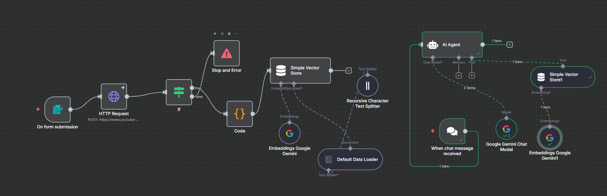

# YouTube Transcript RAG Agent (n8n + Google Gemini)

This repository contains an **n8n workflow** that builds a Retrieval-Augmented Generation (RAG) system using YouTube transcripts and Google Gemini.

## Features

* Fetches transcripts from YouTube videos based on form input
* Splits transcript into chunks for efficient retrieval
* Generates embeddings with **Google Gemini Embeddings**
* Stores data in **n8n Simple Vector Store**
* Enables conversational Q\&A with an **AI Agent (Google Gemini Chat Model)**

## Workflow Overview

1. **On Form Submission** → Triggers transcript fetch via HTTP Request
2. **Validation & Error Handling** → Stops if transcript is missing
3. **Embedding & Storage** → Text is split, embedded (Gemini), and saved to a vector store
4. **Conversational Agent** → User messages are answered using Gemini + vector store retrieval

## Setup

1. Import the provided JSON workflow into your **n8n instance**
2. Configure the following credentials:

   * Google Gemini API Key
   * YouTube Transcript API (or backend endpoint)
3. Run the workflow and test with any YouTube video link

## Use Cases

* Q\&A over YouTube lectures, podcasts, or tutorials
* Knowledge extraction from video transcripts
* Extendable to PDFs, docs, or any text-based sources

## Files

* `youtube-RAG.json` → Exported n8n workflow
* `workflow.png` → Visual representation of the workflow
